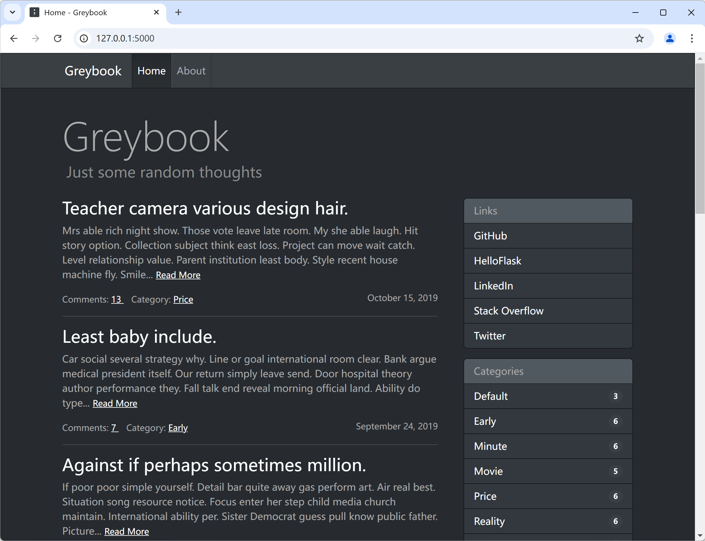

# Greybook

A blog engine built with Python and Flask. The example application for the book *[Python Web Development with Flask](https://helloflask.com/en/book/1)* (《[Flask Web 开发实战（第 2 版）](https://helloflask.com/book/4)》).

Demo: http://greybook.helloflask.com



## Installation

Clone the repo:

```
$ git clone https://github.com/greyli/greybook
$ cd moments
```

Install dependencies with [PDM](https://pdm.fming.dev):

```
$ pdm install
```

> [!TIP]
> If you don't have PDM installed, you can create a virtual environment with `venv` and install dependencies with `pip install -r requirements.txt`.

To initialize the app, run the `flask init-blog` command:

```
$ pdm run flask init-blog
```

If you just want to try it out, generate fake data with `flask lorem` command:

```
$ pdm run flask lorem
```

It will create a test account:

* username: `admin`
* password: `greybook`

Now you can run the app:

```
$ pdm run flask run
* Running on http://127.0.0.1:5000/
```

## License

This project is licensed under the MIT License (see the
[LICENSE](LICENSE) file for details).
